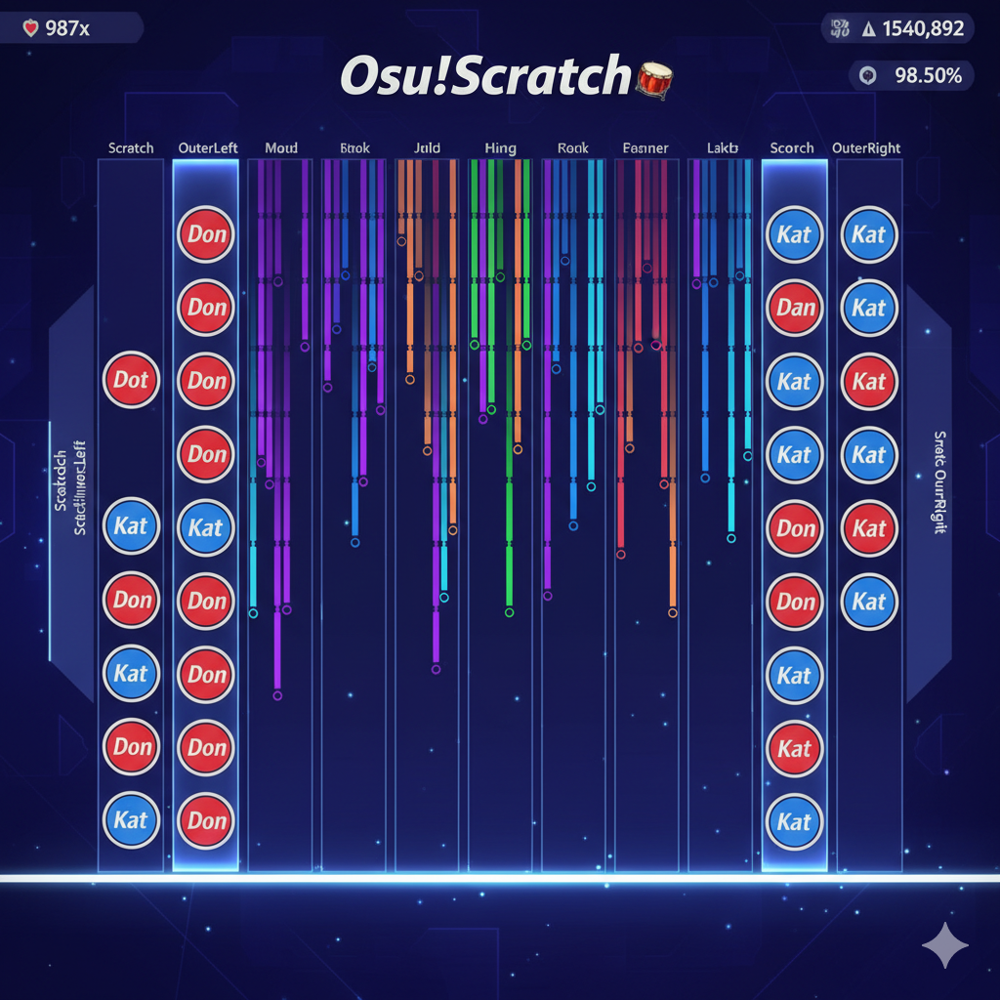
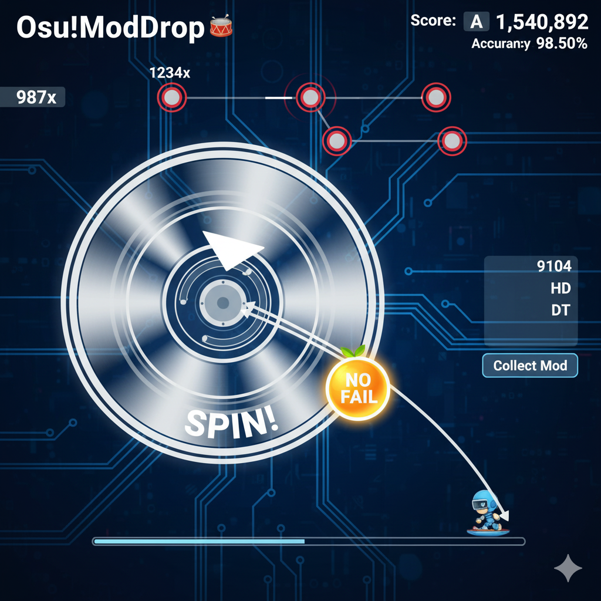

# osu-fusion-ruleset
Next-generation cross-mode gameplay for osu!lazer. This repository hosts a suite of experimental, community-driven rulesets for osu!lazer, focused on merging core mechanics from multiple official game modes to create entirely new rhythmic challenges

🌟 Introduction

This project is an ambitious attempt to push the boundaries of custom ruleset development within the osu!framework. It is a passion project developed to explore complex data structures and object-oriented programming in C# by creating two fundamentally new and challenging game modes: osu!Scratch and osu!ModDrop.

✨ Core Rulesets

1. osu!Scratch (Mania + Taiko Fusion)
#### Visualization:

The ultimate test of rhythmic independence and coordination. This mode layers a complete Taiko-style input layer onto the vertical scrolling mania playfield.
Feature	Description
Input Scheme	10K Total: A standard 6K VSRG core, flanked by 4 dedicated scratch inputs (L-Outer, L-Inner, R-Inner, R-Outer).
Gameplay	Players must hit vertical VSRG notes while simultaneously managing complex Don/Kat rhythms on the scratch lanes, acting as a secondary percussion or melody track.
Challenge	Forces highly polyrhythmic input and cross-hand coordination, similar to playing a drum kit while reading sheet music.

2. osu!ModDrop (Standard + Catch Fusion)

#### Visualization:

A high-risk, high-reward mechanic that integrates the Catch game mode into Standard gameplay to allow for mid-map mod acquisition.
Feature	Description
Core Mechanic	Spinner objects are converted into Mod Droppers.
Loot	When a player successfully spins a Mod Dropper, it scatters Mod Fruits (e.g., No Fail, Hidden, Double Time) that fall toward the bottom of the screen.
Collection	The player controls the osu!Catch Catcher at the bottom of the screen to collect the falling Mod Fruits.
Result	Collecting a Mod Fruit dynamically applies or removes that Mod for the rest of the map, adding a crucial layer of strategic decision-making mid-play.

⚙️ Development Setup

The osu-fusion-ruleset is a custom ruleset assembly for osu!lazer.

Prerequisites

    C# IDE: Visual Studio or JetBrains Rider (recommended for cross-platform/Linux).

    .NET SDK: Install the latest .NET SDK (currently targeting .NET 8 or newer).

    osu!lazer Source: Clone the main ppy/osu repository to access necessary dependencies and development tools.

Building and Installation

    Clone the Repository:
    Bash

git clone https://github.com/YOUR_USERNAME/osu-fusion-ruleset.git

Add to Solution: It is highly recommended to integrate this project into your local ppy/osu solution (osu.sln) to manage dependencies easily.

Build: Run a standard C# build using your IDE or the CLI:
Bash

    dotnet build

    Install: Copy the resulting .dll file from your build output (bin/Debug/net8.0/osu.Game.Rulesets.Scratch.dll) into the rulesets folder of your osu!lazer installation:

        Windows: %appdata%/osu/rulesets

        Linux/macOS: ~/.local/share/osu/rulesets (or similar, depending on your install)

🤝 Contribution

We welcome contributions! Whether you're interested in C# development, creating custom sprites/assets, or simply testing and reporting issues, your help is appreciated.

    C# Developers: Help implement the core HitObject conversion and Mod application logic.

    Mappers: Help design test maps that utilize the new 10K input structure for osu!Scratch.

    Artists: Design compelling Mod Fruit sprites for osu!ModDrop.

Feel free to open an Issue or submit a Pull Request.

📄 License

This project is licensed under the MIT License, in line with the overarching ppy/osu project. See the LICENSE file for details.

🙏 Credits

    Built on the exceptional osu!framework developed by ppy.

    Inspired by the creativity of the wider osu! community and the potential of custom rulesets.
